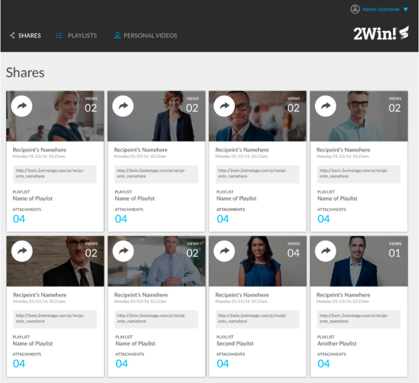
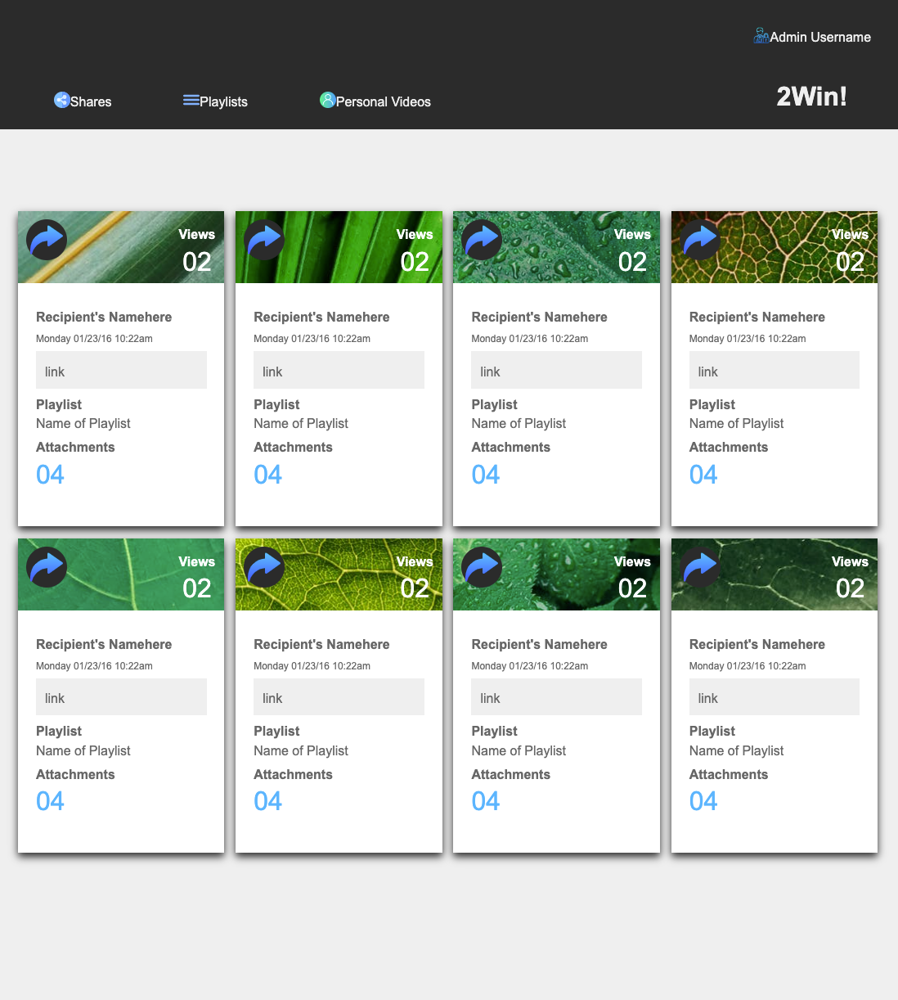
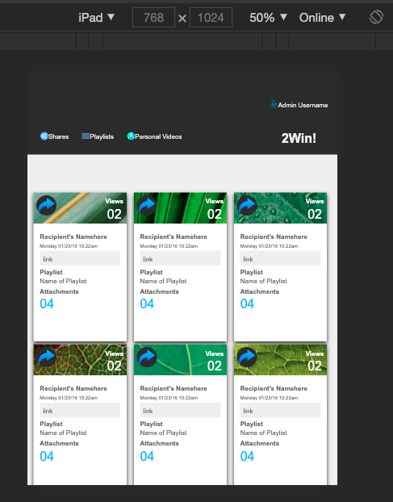
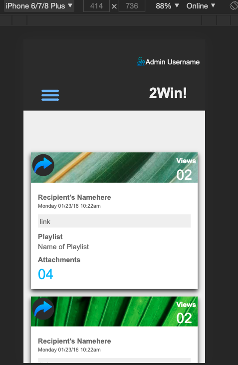

# Static Comp Challenge

### Overview
The goal for this project was to recreate a webpage based off a provided static comp. I used media query breakpoints and relative units to create a responsive design as well as normalize so that there is consistency across browsers when viewing the page. With the provided time, I tried to build a page that respected the integrity of the original design with a few personal choices for images used.

### Preview

Original Comp

Desktop View

iPad View

Mobile View

Responsive Design Gif

